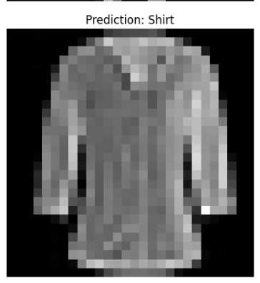
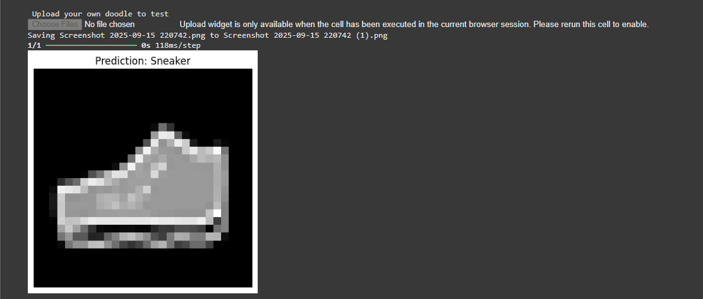
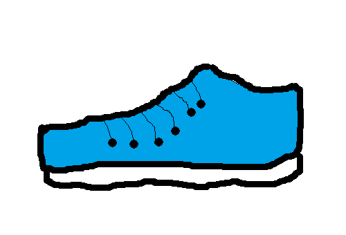

# FitCheck

## Project Overview
FitCheck is a simple image classification project built using the **Fashion MNIST dataset**.  
It classifies grayscale images of clothing into 10 categories such as T-shirts, trousers, pullovers, dresses, coats, sandals, shirts, sneakers, bags, and ankle boots.

## Workflow
- **Dataset**: Fashion MNIST (70,000 images, 28x28 pixels, 10 categories).
- **Preprocessing**: Normalized images (pixel values scaled between 0 and 1), pixel sized to 28x28.
- **Model**: A simple neural network built using TensorFlow/Keras.
- **Training**: Trained for multiple epochs to reach ~90% accuracy.
- **Testing**: Tested on both the Fashion MNIST test set and my own doodle sketches.

## Results
- Achieved ~88–90% accuracy on test images.
- Correctly classified some custom doodle inputs (e.g., sneakers).

## Requirements
Install dependencies with:
```bash
pip install -r requirements.txt





